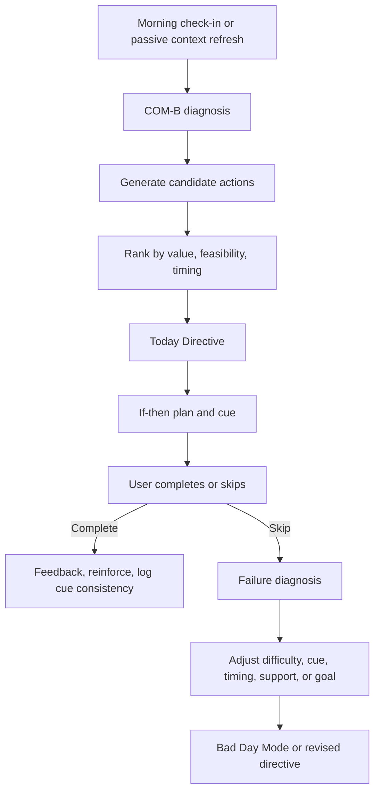
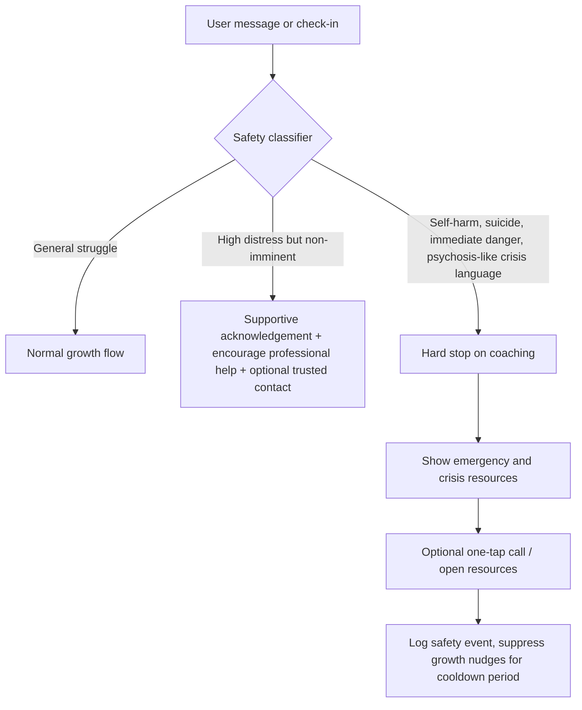
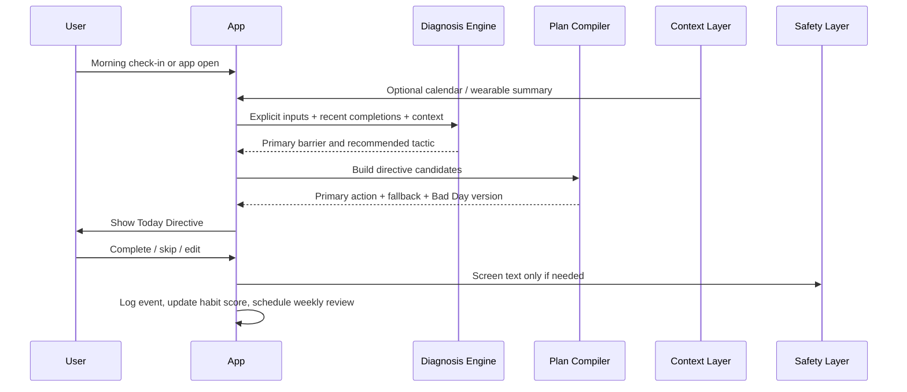

# Evidence-Based Growth Systems for a Personal Growth App

## Executive summary

The strongest evidence does **not** support a “motivation app” built around inspiration, quotes, or generic streak pressure. Lasting change is more reliably produced by a tighter loop: diagnose the real barrier, connect the behaviour to a personally endorsed reason, turn it into a concrete if-then plan, make it easy to do in a stable context, monitor it, and review misses without shame so the plan gets better rather than abandoned. Across the evidence base, the most dependable mechanisms are self-monitoring, goal and action planning, feedback, consistent cues, autonomous motivation, and carefully designed support. citeturn22view2turn17view0turn16view2turn19view0turn21view0turn39search1turn26search5

Among the named models you asked for, **COM-B** is best treated as a diagnostic lens, not a magic intervention by itself: behaviour depends on capability, opportunity and motivation, so your app should first identify which of those is failing before it prescribes anything. **Self-Determination Theory** has small but reliable pooled effects in health behaviour change, and those effects appear to work through autonomous motivation and perceived competence. **Implementation intentions** have one of the strongest classic meta-analytic effects in this space, with large gains in goal attainment and in preventing derailment. **WOOP or MCII** adds a smaller but still useful boost by forcing reality-based obstacle planning. **Habit automaticity** matters for maintenance, but habits usually take much longer than “21 days”; newer review evidence suggests roughly **two to five months** for many health habits, with wide variation by person and behaviour. citeturn25search2turn17view0turn16view2turn19view0turn21view0

From a product perspective, the implication is blunt: the app should function as a **personal operating system for change**, not as a content feed. The core loop should be: **diagnosis flow → Today Directive → if-then plan → completion tracking → failure diagnosis → adaptive reset**. The highest-value early features are therefore a COM-B diagnosis flow, a behaviour contract builder, a one-action Today Directive, a habit tracker with cue logging, a non-shaming failure diagnosis, and a Bad Day Mode that scales a plan down instead of punishing the user for imperfection. Social features should be **opt-in, permissioned and process-focused**, because support helps most when it creates clear, user-chosen accountability rather than surveillance. citeturn25search2turn16view2turn22view2turn39search1turn26search5turn26search13

For data, default to **explicit user input first**, then optional calendar and wearable context, and only then carefully bounded passive signals. Australian and international privacy guidance is clear on the direction of travel: collect only what is reasonably necessary, be explicit about purpose, minimise storage, let users pause sync and revoke access, and avoid opaque secondary use of sensitive data. For health-style permissions, Apple and Google both emphasise user-controlled, fine-grained access; Health Connect explicitly recommends in-app settings to pause sync and manage permissions. citeturn29view0turn29view1turn29view4turn29view5turn2search0turn2search4turn27view5turn27view4

Safety-wise, keep the product positioned as **general wellness and personal growth**, not therapy, crisis care, diagnosis or treatment, unless you intentionally choose the clinical-regulatory path. In Australia, software that diagnoses, screens, monitors symptoms, or provides therapy for mental health conditions can fall into TGA-regulated digital mental health tools, while pure general wellness or non-clinical tracking can be excluded. Your app should therefore have hard boundaries, crisis signposting, escalation rules, and language that never implies it replaces professional care. citeturn35view0turn35view1turn35view2turn35view3turn13search0turn13search1turn13search11

## What the evidence says about lasting change

### Core models and what they are actually good for

| Model | What it explains best | Strongest evidence worth using in product decisions | What this means for the app |
|---|---|---|---|
| **COM-B** | Why a behaviour is not happening: lack of capability, opportunity, motivation, or some combination | The Behaviour Change Wheel places capability, opportunity and motivation at the centre of behaviour change; later empirical work supports COM-B as a practical intervention-planning frame across eating and physical activity, but it is primarily a **diagnostic scaffold**, not a single effect-size intervention. citeturn25search2turn25search8turn25search20 | Use COM-B at onboarding, after lapses, and before recommendations. Never prescribe a productivity tactic for an opportunity problem or a reminder for a skills problem. |
| **Self-Determination Theory** | Why people persist: behaviour lasts better when it is autonomously chosen and people feel competent | Meta-analysis of 65 SDT intervention tests found a small but significant average effect on health behaviour (**d = .23**, bias-corrected **d = .15**), with mediation through **autonomous motivation** and **perceived competence**. citeturn17view0 | Design for choice, personally meaningful reasons, and small wins. Your UX should grow “I want to” and “I can”, not “the app told me to”. |
| **Implementation intentions** | How intentions become action in the moment | Classic meta-analysis found medium-to-large effects on goal attainment overall (**d = .65**), on getting started (**d = .61**), and on preventing derailment (**d = .77**). The same source also notes that “good intentions” were translated into action only about **53%** of the time. citeturn16view2turn16view3 | Every meaningful plan in the app should end with an if-then. Goals without a cue, time or contingency are incomplete objects. |
| **WOOP / MCII** | How to turn wishful thinking into realistic execution | Meta-analysis of 24 effect sizes and 15,907 participants found MCII effective for goal attainment with **g = 0.336**; interactive delivery was stronger (**g = 0.465**) than document-style delivery (**g = 0.277**). citeturn19view0 | Build WOOP as an interactive conversation, not a static worksheet. Make obstacle identification and response planning unavoidable. |
| **Habit automaticity** | How repeated behaviours become easier to maintain | A 2024 systematic review and meta-analysis found health habit formation usually takes **about two to five months**, with substantial variability from **4 to 335 days**; habit-focused interventions improved habit scores overall (**SMD = 0.69**). citeturn21view0 | Promise consistency, not speed. Design for repetition in stable contexts and celebrate automaticity growth, not just completion counts. |

### The most reliable drivers of change beyond the named models

The evidence around behavioural techniques is unusually consistent on one point: **self-monitoring punches above its weight**. In a meta-regression of healthy eating and physical activity interventions, prompt self-monitoring explained the greatest share of between-study heterogeneity, and interventions with self-monitoring plus other techniques outperformed those without it (**0.42** vs **0.26** pooled effect sizes). citeturn22view2

For **engagement** in digital health apps specifically, a recent systematic review found six techniques repeatedly associated with better engagement: **goal setting, self-monitoring, feedback on behaviour, prompts/cues, rewards, and social support**. A separate systematic review of habit-oriented digital behaviour change designs found that the most commonly used techniques were **self-monitoring, goal setting, and prompts/cues**, with time-based cues, automatic monitoring, descriptive feedback and virtual rewards heavily represented. citeturn39search1turn40view0

Digital delivery itself can work, but it usually produces **small-to-moderate** effects rather than miracles. A 2025 meta-analysis of standalone digital behaviour change interventions found significant improvements in physical activity (**SMD = 0.324**) and body metrics (**SMD = 0.269**). Wearable activity trackers, when used as part of behaviour change systems, improved physical activity by roughly **1,800 extra steps per day** and about **40 minutes more walking per day** in umbrella-review evidence. The right conclusion is not “wearables solve behaviour change”; it is that digital systems work best when they combine monitoring, goals, feedback and context-aware prompts. citeturn41view0turn27view0

Support matters, but the evidence is messier than product teams often assume. The **Supportive Accountability** model argues that human support improves adherence when the supporter is seen as trustworthy, benevolent and competent, and when expectations are clear, process-oriented and set with the user. But later reviews show support effects vary by domain and implementation. That means your app should use support circles as an **optional amplifier**, not as a default dependency. citeturn26search5turn26search0turn26search13turn26search4

## Product features mapped to mechanisms

### Recommended feature-to-mechanism map

| Feature | Mechanism | Why it is worth building | Key design rule |
|---|---|---|---|
| **Diagnosis flow** | COM-B behavioural diagnosis | Prevents wrong prescriptions by identifying whether the blocker is skill, context, motivation, overload, low confidence, or missing cue. citeturn25search2turn25search20 | Ask the minimum questions needed to classify the barrier, then tailor the remedy. |
| **Behaviour contract** | Self-determined commitment + if-then planning + supportive accountability | Converts a vague aspiration into a specific, user-endorsed promise, and works better when expectations are process-oriented and optionally shared. citeturn17view0turn16view2turn26search5 | The user writes the commitment; the app helps structure it. |
| **Habit tracker** | Self-monitoring + feedback + cue repetition | One of the highest-confidence features in the evidence base; also improves engagement. citeturn22view2turn39search1turn40view0 | Track behaviour, cue, time and difficulty, not just streak length. |
| **Failure diagnosis** | Problem solving + COM-B reclassification + non-shaming adaptation | The evidence says plans fail because intentions are underspecified, cues are weak, contexts are unstable, or demands exceed capacity. citeturn16view2turn21view0turn25search2 | “What got in the way?” should lead to a changed plan, not a guilt screen. |
| **Bad Day Mode** | Goal scaling + competence protection + anti all-or-nothing thinking | Smaller, easier, time-bounded actions help habit formation and preserve continuity when full execution is unrealistic. citeturn21view0turn17view0turn16view2 | Replace “missed” with “reduced version completed” wherever appropriate. |
| **Support circle permissions** | Relatedness + supportive accountability | Social support is repeatedly linked with engagement, but only when it feels supportive rather than invasive. citeturn39search1turn26search5turn26search13 | The user chooses who sees what, for how long, and why. |
| **Today Directive** | Cognitive simplification + action planning + cueing | Strong plans become weak when the user faces a long list. One specific next action reduces friction and execution ambiguity. This is an implementation inference grounded in planning, cueing and self-monitoring evidence. citeturn16view2turn22view2turn40view0 | Deliver one primary action, one backup option, and one Bad Day version. |
| **Life Map** | Values clarification + autonomous motivation | SDT implies behaviour lasts better when linked to personally endorsed values and identities, not external pressure. citeturn17view0 | Keep it lightweight and revisitable; use it to justify plans, not as a one-off vision board. |
| **Future Self builder** | Mental contrasting + self-concordance inference + concrete translation | Future-oriented reflection helps most when it ends in obstacle planning and an if-then plan, not fantasy alone. That is an implementation inference from MCII and SDT. citeturn19view0turn17view0 | Every future-self session should generate one present-tense commitment. |

### The recommended core loop

The product loop below is the shortest route from evidence to useful software: diagnose the barrier, generate one feasible action, turn it into a concrete plan, record the outcome, then adapt after misses. This is where your evidence-based advantage actually lives. citeturn25search2turn16view2turn22view2turn21view0

### What I would not build early

I would **not** make streaks the centre of the system; the evidence is much stronger for self-monitoring, cue stability and adaptive review than for punitive streak mechanics. I would also avoid building a “feed” of generic growth content as the core product. That can increase time-in-app while doing very little for behaviour change. Finally, I would avoid automatic mental-state inference from passive data in the MVP unless you have a very strong reason, clear explainability and robust privacy governance. citeturn22view2turn21view0turn30view0

## UX language, data signals and privacy

### UX patterns and microcopy that support autonomy, competence and relatedness

The cleanest SDT-compatible UX pattern is **choice plus rationale**. In digital health communication, providing choice improved intervention evaluation and relevance more reliably than “autonomy-supportive language” alone. So the app should not merely sound polite; it should genuinely let the user choose the path, intensity and timing where possible. citeturn33view0turn17view0

Language should also be **non-judgemental, person-first by default, and preference-sensitive**. Australian Mindframe guidance emphasises language that minimises stigma and harm, and the NIH style guide recommends describing what a person has or experiences rather than reducing them to a label, while allowing identity-first language where the person or community prefers it. That matters in a personal-growth app because shame is corrosive to persistence. citeturn33view3turn33view4turn9search4

| UX moment | Better microcopy | Weaker microcopy |
|---|---|---|
| Onboarding choice | “Which change feels most worth doing first?” | “Pick the goal you should start with.” |
| Rationale | “This helps because it removes friction at the time you usually get stuck.” | “Experts say this is the best method.” |
| Low confidence | “Want to shrink this to a 2-minute version?” | “Commit harder.” |
| Missed action | “Looks like the plan didn’t fit the day. What got in the way?” | “You broke your streak.” |
| Support invite | “Would you like one trusted person to see only today’s check-in status?” | “Invite friends to keep you accountable.” |
| Bad Day Mode | “Today counts if you do the reduced version.” | “Anything less than the target is a fail.” |

Those examples are partly design inference, but they are grounded in the evidence that choice supports autonomy, competence needs to be protected, and shame-reinforcing language increases harm and stigma risk. citeturn33view0turn17view0turn33view3turn33view4

### Data sources, signal hierarchy and consent rules

The right data strategy is **progressive disclosure of sensitivity**: start with explicit inputs, then move to calendar and wearable context, and use passive data only where the incremental decision value clearly outweighs the privacy cost. Australian guidance requires data collection to be reasonably necessary and proportionate, and EU guidance similarly emphasises purpose limitation, data minimisation and storage limitation. citeturn29view0turn29view1

| Data source | Good uses | Relative value | Privacy sensitivity | Rule |
|---|---|---|---|---|
| **Explicit inputs**: values, goals, confidence, energy, reasons, preferred times | Behaviour diagnosis, plan generation, weekly review | Highest | Lowest | Default first. Ask directly before inferring. citeturn17view0turn25search2 |
| **Calendar**: free windows, meetings, routines | Scheduling If-Then plans and Today Directive timing | High | Medium | Read availability and structure, not full content where avoidable. Use purpose-specific consent. citeturn29view0turn29view1 |
| **Wearables / HealthKit / Health Connect**: steps, sleep, workouts, maybe mindfulness records | Progress detection, recovery-aware suggestions, cue timing | High for some users | Medium-high | Make categories optional and granular. Give users in-app sync pause and permission management. citeturn27view0turn2search0turn2search4turn27view4turn27view5 |
| **Passive phone telemetry**: notification response, app open times, rough routine patterns | JITAI timing and engagement optimisation | Moderate | High | MVP should keep this narrow, transparent and local-first where possible. citeturn30view0turn29view4 |
| **High-risk passive signals**: precise location history, contacts, microphone, message content | Rarely justified for a general wellness app | Low-to-moderate | Very high | Avoid unless a later clinical product case clearly justifies it and users can truly understand the trade-off. citeturn30view0turn29view4turn35view0 |

A practical privacy rule-set for this app would be:

1. **Purpose-specific consent** for each sensitive source.  
2. **Pause sync** and **revoke permissions** from inside the app, mirroring Health Connect guidance.  
3. **Short retention by default**, with clear deletion/export controls.  
4. **No sale or secondary commercial reuse** of sensitive personal data without separate explicit consent.  
5. **On-device or local-first processing** wherever possible for intimate journalling or check-in data.  
6. **Explainable inferences**: if the app uses a signal to alter a recommendation, it should say so in plain language. citeturn27view5turn29view0turn29view1turn29view4turn37view0turn37view1

Daylio and Finch are useful counterexamples here because their official help materials show strong local-first patterns: both emphasise local data storage by default in common use cases, and Daylio explicitly states it does not store entries on its servers. You do not need to copy their exact architecture, but you should copy the principle that intimate self-reflection data should not casually become server exhaust. citeturn37view0turn37view1turn37view2

## Safety boundaries and escalation

The safest positioning is to describe the product as a **personal growth and general wellness app** that helps users set goals, form habits and reflect on progress. That keeps you closer to the TGA’s general wellness exclusion and away from implied diagnosis or therapy claims. The moment the app screens for mental health conditions, monitors symptoms clinically, or provides therapeutic interventions, the regulatory picture changes materially. citeturn35view1turn35view0turn35view3

TGA guidance states that digital mental health tools are likely to be medical devices if they are intended to **diagnose or screen**, **monitor symptoms or treatment**, or **provide therapeutic interventions** such as CBT. By contrast, software that only records symptoms without analysis, displays information, schedules appointments or supports records can be outside that scope. TGA also notes a conditional exclusion for some mental-health tools based on established clinical practice guidelines that are clearly referenced and reviewable inside the software, but that is not a free pass; you would still need careful legal and regulatory review before making clinical claims. citeturn35view0turn35view2

So the operating rule should be simple: **do not let the AI pretend to be a therapist, crisis worker or diagnostician**. It can help a user plan a walk, identify friction, choose a tiny next step, or prepare for a hard day. It should not interpret passive data as “you are depressed”, tell a distressed user they are safe, or provide crisis counselling. NICE guidance also recommends that digital behaviour-change interventions supplement existing services rather than replace them. citeturn35view4turn35view0

A minimum viable escalation model for Australia should include immediate signposting when a user expresses self-harm, suicide intent, immediate danger, severe confusion or requests emergency help. Official services include **Triple Zero (000)** for immediate danger, **Lifeline 13 11 14** for 24/7 crisis support, **Suicide Call Back Service 1300 659 467**, and **NSW Mental Health Line 1800 011 511** for NSW users. citeturn13search1turn13search0turn13search13turn13search11

## Metrics, evaluation and roadmap

### What to measure

A common product mistake is to optimise for opens, streaks and notification clicks while ignoring whether the user is actually changing behaviour or feeling better. The better model is a **stacked measurement system**: engagement, mechanism activation, behaviour change, wellbeing, and safety. NICE’s real-world evidence framework is useful here because it emphasises clearly defined questions, relevant outcomes, data provenance and transparent study conduct. citeturn36view1turn35view4

| Metric layer | Suggested measures | Why it matters |
|---|---|---|
| **Engagement** | onboarding completion, plan creation rate, D1/D7/D30 retention, weekly active planners, Today Directive open-to-complete rate | Engagement is necessary but not sufficient. citeturn11search1turn26search20 |
| **Mechanism activation** | % of plans with if-then structure, WOOP completion rate, average confidence rating, proportion of users who revise plans after a lapse, support-circle opt-in rate | Tells you whether the behavioural machinery is actually being used. citeturn16view2turn19view0turn26search5 |
| **Behaviour change** | target habit completion rate, days-per-week target behaviour, streak continuity with Bad Day completions included, wearable-confirmed activity where relevant | Behaviour, not app time, is the true product output. citeturn22view2turn27view0turn41view0 |
| **Maintenance** | SRBAI habit automaticity score at baseline, week 4, week 8, week 12; cue consistency rate | Durable change should show increasing automaticity, not just temporary compliance. citeturn32search0turn21view0 |
| **Wellbeing and need support** | WHO-5, BPNSFS short-form items, self-rated progress and energy | If a growth app creates output but crushes wellbeing, it is defective. citeturn31view3turn31view5 |
| **Quality and satisfaction** | uMARS after week 2 or week 4, qualitative verbatims | Helps catch UX failures that event data misses. citeturn31view1 |
| **Safety and trust** | permission revocation rates, safety-trigger impressions, support resource clicks, complaint rate, false safety flag review rate | Trust and safety are product outcomes, not legal footnotes. citeturn29view0turn35view0 |

A compact analytics event table for the MVP could look like this:

| Event | Properties |
|---|---|
| `goal_created` | domain, self-rated importance, confidence, autonomy_reason_present |
| `directive_generated` | behaviour_id, type, difficulty, time_window, source_signals_used |
| `if_then_saved` | cue_type, location, time_anchor, fallback_present |
| `contract_signed` | private/shared, supporter_count, review_date |
| `habit_logged` | completed, reduced_version, duration, cue_match |
| `failure_diagnosis_submitted` | primary_barrier_com_b, friction_level, confidence_next_attempt |
| `bad_day_mode_used` | original_difficulty, reduced_difficulty, completion |
| `support_permission_changed` | supporter_role, access_scope, expiry |
| `who5_completed` | score_total |
| `srbai_completed` | score_total, behaviour_id |
| `safety_triggered` | trigger_type, self-initiated/help-seeking, resource_shown |

### Evaluation plan and prioritised MVP roadmap

Your first evaluation goal should not be “prove the whole app works”. It should be **prove the core loop works better than weaker alternatives**. That means instrumenting the product properly, running A/A checks, then using small A/B tests on mechanism-rich components: choice framing, WOOP vs plain planning, Bad Day Mode availability, and whether support-circle prompts are optional vs default. citeturn33view0turn19view0turn36view1

| Phase | What to ship | Effort | Likely impact | Why it belongs here |
|---|---|---:|---:|---|
| **Foundation MVP** | account, consent centre, event taxonomy, COM-B diagnosis, Today Directive, if-then plan builder, habit tracker, weekly review, safety signposting | Medium | Very high | This covers the highest-confidence mechanisms: diagnosis, planning, self-monitoring, feedback. citeturn25search2turn16view2turn22view2 |
| **Behaviour engine MVP** | WOOP builder, behaviour contract, failure diagnosis, Bad Day Mode, values-based Life Map | Medium | High | These features improve intention quality, recovery after lapses and autonomous motivation. citeturn19view0turn17view0turn21view0 |
| **Context and support** | calendar sync, support circle permissions, wearable import, recovery-aware timing | Medium-high | High for the right users | Context and support can amplify a solid core, but should not precede it. citeturn26search5turn27view0turn27view5 |
| **Adaptive intelligence** | JITAI timing engine, passive routine signals, personalised prompt ranking, experiment engine | High | Medium-high | Valuable, but only after you trust the basics and have consent architecture. citeturn30view2turn30view0 |
| **Clinical extension** | any therapy-like flows, symptom monitoring, clinical pathways | High | Potentially high but regulated | Only pursue deliberately, with regulatory and safety infrastructure. citeturn35view0turn35view2turn35view3 |

**Quick wins** are the Today Directive, if-then plan builder, habit tracker, and failure diagnosis. They are relatively cheap compared with a fully adaptive AI stack, and they sit directly on top of the strongest evidence. citeturn16view2turn22view2turn39search1

## Architecture, flows and templates

### Implementation architecture overview

A sane architecture for this app is a **local-first behavioural system with cloud sync where needed**, not a giant undifferentiated AI memory. The data model should preserve the difference between goals, behaviours, plans, completions, and reflections so the daily algorithm can reason about them cleanly. This is an implementation recommendation inferred from the evidence and from privacy principles favouring data minimisation and explainability. citeturn29view0turn29view1turn29view5

| Core object | Key fields |
|---|---|
| `User` | timezone, consent flags, preferred language, safety region |
| `ValueMap` | domains, values, importance, notes |
| `FutureSelf` | horizon, narrative, domains, tensions |
| `Goal` | title, domain, why_it_matters, autonomy_reason |
| `BehaviourTarget` | goal_id, frequency, minimum_viable_version, cue_preference |
| `WOOP` | wish, outcome, obstacle, plan |
| `IfThenPlan` | trigger_type, trigger_value, action, fallback_action |
| `BehaviourContract` | commitment_text, review_date, supporter_scope |
| `CheckIn` | mood, energy, confidence, availability, friction |
| `Directive` | date, primary_action, fallback_action, bad_day_action, rationale |
| `CompletionEvent` | directive_id, completed, reduced_version, duration, cue_match |
| `FailureDiagnosis` | reason_text, COM-B category, revised_plan |
| `SupportGrant` | supporter_id, permission_scope, expiry |
| `DataConnection` | source_type, categories_granted, last_sync, paused |
| `SafetyEvent` | trigger_type, resource_shown, cooldown_until |
| `ExperimentAssignment` | experiment_id, variant, enrolled_at |

A practical AI toolset would be small and narrow:

| AI tool | Function | Hard guardrail |
|---|---|---|
| **Diagnosis engine** | classify barrier into capability, opportunity, motivation, overload, habit fragility | no diagnosis of mental illness |
| **Directive generator** | produce one feasible action, backup option, and reduced version | must expose editable rationale |
| **Plan compiler** | turn natural language intent into WOOP + if-then + calendar anchor | user must confirm before saving |
| **Lapse analyser** | convert a miss into revised cue, timing, difficulty, or support | no shaming language |
| **Support permissions assistant** | explain data-sharing scopes in plain English | least-privilege defaults |
| **Safety copy guardrail** | intercept risky outputs and replace with signposting | no “you are safe” assurances |

### Sample daily algorithm and flow

The ranking logic for `Today Directive` should be simple enough to explain. A robust starting formula is:

**Directive Score = Importance × Feasibility × Timing Fit × Continuity Benefit**

Where:
- **Importance** comes from the user’s stated goals and values.
- **Feasibility** comes from confidence, energy, friction and recent misses.
- **Timing Fit** comes from available time windows and cue stability.
- **Continuity Benefit** rewards actions that preserve a developing habit loop without relying on punitive streak logic.  

That ranking approach is an implementation inference from SDT, implementation intentions, self-monitoring and habit-formation evidence. citeturn17view0turn16view2turn21view0

### Example user journeys and templates

| Template | Minimal fields | Strong example |
|---|---|---|
| **Behaviour contract** | “I’m committing to…”, why it matters, minimum version, review date, optional supporter | “I’m committing to a 10-minute walk after lunch on weekdays because I want steadier energy for work and caring. Minimum version: 3 minutes. Review: next Sunday.” |
| **WOOP** | Wish, Outcome, Obstacle, Plan | “Wish: write daily. Outcome: feel calmer and clearer. Obstacle: I avoid starting when I’m tired. Plan: If it’s 8:30 pm and I feel resistance, then I write one sentence only.” |
| **Failure diagnosis** | What happened, main blocker, what changes next | “Missed because school pickup ran late. Barrier: opportunity. Change: move walk to right after dinner on Tuesdays and activate Bad Day 3-minute version.” |
| **Bad Day Mode** | reduced version, acceptable completion rule, recovery check | “Original: 30-minute workout. Reduced: 5 minutes mobility. Counts today if completed before bed. Tomorrow morning ask whether the original timing still works.” |

For **Life Map**, keep the template close to domains and tensions: health, work, relationships, money, purpose, recovery. For **Future Self**, ask for one vivid but short picture of the desired future, then immediately force translation into one current behaviour and one obstacle plan. That prevents the feature from drifting into airy self-help theatre. citeturn17view0turn19view0

### Recommended sources to prioritise

If you want the shortest high-value reading list for product strategy, prioritise these sources first:

| Priority | Source type | Why prioritise it |
|---|---|---|
| Highest | Michie et al. on the Behaviour Change Wheel / COM-B citeturn25search2 | Best frame for diagnosis and intervention mapping |
| Highest | Sheeran et al. SDT intervention meta-analysis citeturn17view0 | Strongest direct evidence for autonomy and competence mechanisms |
| Highest | Gollwitzer & Sheeran implementation intentions meta-analysis citeturn16view2turn16view3 | Tells you why plans must be cue-linked |
| Highest | Wang et al. MCII meta-analysis citeturn19view0 | Best evidence for WOOP-style planning |
| Highest | Singh et al. habit formation systematic review/meta-analysis citeturn21view0 | Best update on realistic habit timelines |
| High | Michie et al. self-monitoring meta-regression citeturn22view2 | Justifies habit tracking as a core feature |
| High | Milne-Ives et al. engagement and BCT review citeturn39search1 | Useful for deciding which engagement levers deserve screen space |
| High | Ferguson et al. wearable tracker umbrella review citeturn27view0 | Useful when deciding whether wearables are worth integrating |
| High | NICE ESF and NICE real-world evidence framework citeturn35view4turn36view0turn36view1 | Best practical evidence-generation frameworks for digital health products |
| High | TGA guidance on digital mental health tools and wellness exclusions citeturn35view0turn35view1turn35view2 | Critical for keeping the app on the right side of product claims |
| Benchmark docs | Headspace science, Fabulous science, Daylio privacy, Finch FAQs, Apple HealthKit, Google Health Connect citeturn37view3turn37view5turn37view0turn37view2turn2search0turn27view5 | Useful product-doc comparators for science communication, privacy positioning and permissions UX |

## Open questions and limitations

The evidence base is strongest for **health behaviours** like activity, diet, smoking and related self-management. It is weaker for broad, messy ambitions such as “become my best self”, so some of the product recommendations above are **implementation inferences** that translate validated mechanisms into a general personal-growth context. That is the right way to use the evidence, but it still means you should validate your own target outcomes rather than assume transferability. citeturn17view0turn22view2turn41view0

The support and accountability literature is also mixed. Human support often helps, but not always, and it can reduce autonomy if implemented badly. Treat support circles as optional, revocable and low-pressure until your own experiments show clear benefit. citeturn26search5turn26search0turn26search13turn26search4

Finally, passive sensing and AI personalisation are attractive, but the ethics and privacy literature is a warning sign: the more intimate and opaque your inference layer becomes, the more you must justify it, explain it and constrain it. For an MVP, the safest and smartest move is usually to win with **explicit inputs, concrete plans, adaptive review and respectful UX** before you reach for surveillance-heavy “smartness”. citeturn30view0turn29view0turn29view1turn29view4