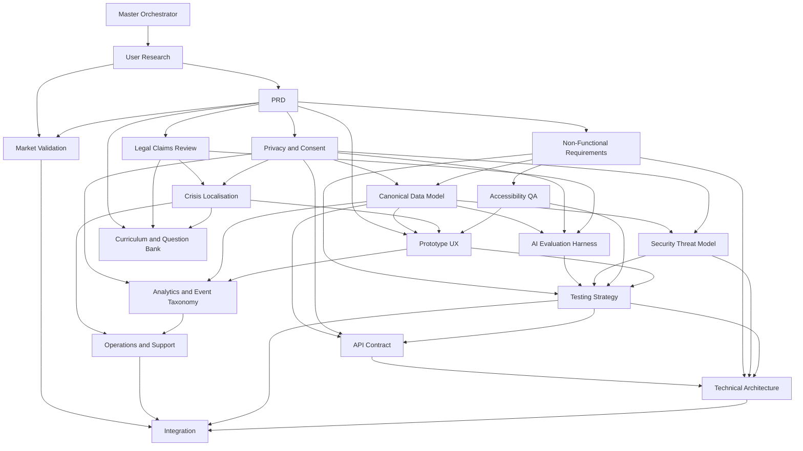

# BecomingOS Master Orchestration Plan

Version: v0.1  
Document path: `docs/07_analysis/work_plan_orchestration_map.md`  
Source artifact: `/Users/sN/Downloads/Workflow coordination plan.docx`  
Review owner: Product lead  
Decision date: Pending product-lead acceptance  
Current decision: No-go for MVP build until all P0 evidence is accepted and Integration Agent confirms readiness.

## Introduction

BecomingOS is an educational, non-clinical personal operating system for self-discovery, behaviour alignment, and daily action. It deliberately avoids therapy, diagnosis, legal, medical, or financial advice, crisis monitoring, and other high-impact decision making.

This repository is documentation-first and readiness-planning-first. It should not be treated as production-ready. Engineering work should wait until the P0 blockers in the readiness checklist are closed with evidence, accepted by the relevant review owners, and synthesised by the Integration Agent.

## Scope

This orchestration plan closes the Master Orchestrator Agent output requirement from `AGENT_OUTPUT_INDEX.md`: a Work Plan / Orchestration Map in `docs/07_analysis/`. It defines specialist-agent objectives, inputs, outputs, acceptance criteria, dependencies, sequencing, risks, readiness gates, and the document set required before engineering begins.

The plan uses these repository prompt files as the benchmark:

- `docs/09_agent_prompts/AGENT_EXECUTION_ORDER.md`
- `docs/09_agent_prompts/AGENT_OUTPUT_INDEX.md`
- `docs/09_agent_prompts/AGENT_READINESS_CHECKLIST.md`
- `docs/README.md`

## Specialist Agent Work Plans

| Order | Agent | Priority | Objective | Deliverables | Acceptance criteria | Dependencies | Output location |
|---:|---|---|---|---|---|---|---|
| 1 | Master Orchestrator Agent | P0 | Define execution plan, sequencing, dependencies, and go/no-go rules. | Work plan, dependency map, required document list. | Covers all agents in execution order, uses readiness checklist as benchmark, and is accepted by product lead. | None. | `docs/07_analysis/` |
| 2 | User Research Agent | P0 | Validate target segments, user problems, and value proposition before build decisions. | Research plan, interview scripts, synthesis template, de-identified findings, personas. | Recruitment avoids vulnerable participants without approval; findings evidence user problems and fit non-clinical boundaries. | Master plan. | `docs/02_research_and_validation/` |
| 3 | PRD Agent | P0 | Convert product intent and research evidence into versioned MVP requirements. | PRD v0.1 with goals, stories, features, metrics, out-of-scope items, boundaries, privacy needs, and release gates. | Includes measurable metrics, P0 boundaries, AI draft confirmation, deletion rules, and product-owner acceptance. | User research, master plan. | `docs/01_product/` |
| 4 | Privacy and Consent Agent | P0 | Define data inventory, consent, retention, deletion, export, and AI-use permissions. | Privacy and consent pack. | Includes lawful basis/purpose, consent flows, retention, deletion, export, crisis-text exclusion, embedding invalidation, and privacy/legal acceptance. | PRD, data model draft, legal guidance. | `docs/05_privacy_legal_safety/` |
| 5 | Legal Claims Review Agent | P0 | Ensure product copy and claims avoid therapy, diagnosis, prohibited services, and misleading promises. | Approved/rejected phrase list, risk analysis, copy edits, future-claims guidelines. | All claim risks identified; safe wording integrated into PRD and product/marketing copy; legal-owner acceptance. | PRD, privacy pack, research insights. | `docs/05_privacy_legal_safety/` |
| 6 | Non-Functional Requirements Agent | P0 | Define measurable system qualities for MVP readiness. | NFR document with performance, reliability, privacy, security, accessibility, safety, and test methods. | Criteria are measurable, testable, implementation-neutral, aligned with PRD boundaries, and accepted by engineering/product owner. | PRD, privacy pack, security, crisis, accessibility inputs. | `docs/06_architecture_and_api/` |
| 7 | Canonical Data Model Agent | P0 | Define entities, relationships, memory lifecycle, consent annotations, deletion, and embedding invalidation. | Canonical data model with diagrams and lifecycle rules. | Covers all data types, consent/deletion metadata, rejected/deleted-memory isolation, and data/privacy acceptance. | PRD, privacy pack, NFRs. | `docs/04_ai_memory_and_data/` |
| 8 | AI Evaluation Harness Agent | P0 | Plan evaluation of AI interpretation and decision-support features for quality, safety, privacy, and refusal behaviour. | AI evaluation harness plan with test categories, metrics, review process, thresholds, and dataset plan. | Covers golden, red-team, refusal, privacy, and deleted-memory scenarios; avoids sensitive-data storage; AI-safety acceptance. | PRD, data model, privacy, legal, NFRs. | `docs/04_ai_memory_and_data/` |
| 9 | Security Threat Model Agent | P0 | Identify assets, attack surfaces, threats, and mitigations. | Security threat model with asset inventory, trust boundaries, threat scenarios, mitigations, severity, and ownership. | Covers prompt injection, AI-provider risk, data exfiltration, unsafe inputs, and actionable mitigations; security-owner acceptance. | PRD, data model, privacy pack, AI evaluation plan. | `docs/05_privacy_legal_safety/` |
| 10 | Crisis Localisation Agent | P0 | Define crisis boundary handling, localised resources, fallback copy, and maintenance process. | Crisis localisation policy. | Includes supported locales, fallback copy, resource maintenance, no default crisis-text storage, and safety/legal acceptance. | PRD, legal, privacy, crisis guidelines. | `docs/05_privacy_legal_safety/` |
| 11 | Accessibility QA Agent | P0 | Define accessibility requirements and validation scripts. | Accessibility QA plan with WCAG 2.2 AA checklist, cognitive accessibility considerations, and test scripts. | Covers contrast, keyboard, screen-reader, alt-text, cognitive considerations, and accessibility-owner acceptance. | Prototype UX, NFRs, WCAG guidance, user research. | `docs/10_operations_testing_accessibility/` |
| 12 | Prototype UX Agent | P0 | Specify low-fidelity validation flows for Modules 0-1. | Prototype UX specification with screen flows, wireframes, copy placeholders, AI draft confirm/edit/reject, skip/pause controls, crisis fallback, and accessibility notes. | Covers complete Modules 0-1 journey and required AI draft controls; design/product acceptance. | PRD, research, curriculum, data model, privacy, crisis, accessibility. | `docs/01_product/` |
| 13 | Curriculum and Question Bank Agent | P0 | Draft educational content and reflective questions for Modules 0-2. | Curriculum and question bank with objectives, micro-lessons, questions, prompt templates, safety notes, and crisis-trigger classification. | Content remains educational and non-clinical, avoids therapy/diagnosis, integrates with UX, and receives curriculum-owner acceptance. | Research, PRD, privacy, legal, crisis, data model. | `docs/03_curriculum_and_questions/` |
| 14 | Market Validation Agent | P1 | Test demand, positioning, pricing, and adoption hypotheses after P0 foundation exists. | Market validation report with experiments, metrics, analysis, segment insights, and go/no-go recommendations. | Experiments use ethical recruitment and consent, measure demand/price sensitivity, and receive product/GTM acceptance. | PRD, research personas, prototype/landing page. | `docs/02_research_and_validation/` |
| 15 | Analytics and Event Taxonomy Agent | P1 | Define privacy-preserving behavioural, learning, and product-health measurement. | Analytics taxonomy with events, properties, consent, minimisation, retention, and anonymisation rules. | Events align with PRD goals, collect only essential metrics, and receive product-analytics acceptance. | PRD, privacy pack, data model, prototype UX, NFRs. | `docs/10_operations_testing_accessibility/` |
| 16 | Operations and Support Agent | P1 | Define support, incident response, export/deletion, consent revocation, and escalation workflows. | Operations and support playbook. | Covers support cases and incidents, accountable owners, privacy/crisis compliance, and operations-owner acceptance. | PRD, privacy, NFRs, crisis, data model, analytics. | `docs/10_operations_testing_accessibility/` |
| 17 | Testing Strategy Agent | P1 | Define coverage, test types, release gates, and defect severity for MVP readiness. | Testing strategy with functional, accessibility, security, privacy, deletion, consent, AI, and crisis/safety coverage. | Includes release gates, test-data rules, deleted-memory scenarios, and QA/engineering acceptance. | NFRs, privacy, data model, AI evaluation, accessibility, UX, analytics, operations. | `docs/10_operations_testing_accessibility/` |
| 18 | API Contract Agent | P1 | Draft conceptual API contracts consistent with requirements, data, consent, and deletion rules. | API specification draft. | Remains conceptual, includes consent/deletion fields and error behaviours, avoids unsupported automation, and receives engineering acceptance. | PRD, data model, privacy, NFRs, prototype UX, testing. | `docs/06_architecture_and_api/` |
| 19 | Technical Architecture Agent | After P0 | Produce a high-level architecture blueprint only after accepted P0 inputs exist. | Architecture blueprint or missing-input list. | Aligns with accepted P0 documents, identifies unresolved questions, avoids premature implementation details, and receives engineering leadership acceptance. | Accepted P0 documents, API draft, security, testing, operations, analytics. | `docs/06_architecture_and_api/` |
| 20 | Integration Agent | Final | Synthesize all outputs and recommend whether to move from prototype to MVP build, closed beta, or production. | Integration readiness pack with status, evidence, unresolved issues, severity, recommendation, and sign-off sheet. | Confirms checklist items with evidence or identifies gaps; gives explicit go/no-go recommendation; product/exec acceptance. | All prior P0 and P1 deliverables. | `docs/08_final_outputs/` |

## Recommended Execution Order

Follow `AGENT_EXECUTION_ORDER.md` exactly:

1. Master Orchestrator Agent
2. User Research Agent
3. PRD Agent
4. Privacy and Consent Agent
5. Legal Claims Review Agent
6. Non-Functional Requirements Agent
7. Canonical Data Model Agent
8. AI Evaluation Harness Agent
9. Security Threat Model Agent
10. Crisis Localisation Agent
11. Accessibility QA Agent
12. Prototype UX Agent
13. Curriculum and Question Bank Agent
14. Market Validation Agent
15. Analytics and Event Taxonomy Agent
16. Operations and Support Agent
17. Testing Strategy Agent
18. API Contract Agent
19. Technical Architecture Agent
20. Integration Agent

P1 agents may run in parallel once P0 direction is stable. The Technical Architecture Agent must not treat architecture as actionable until P0 evidence is accepted. The Integration Agent is the final synthesis gate and must not mark the product build-ready without evidence.

## Dependency Map

## Readiness Gates

Each gate requires evidence, not assertion. Do not mark a gate complete unless the cited document exists and the named review owner has accepted it.

| Gate | Minimum evidence | Go/no-go rule |
|---|---|---|
| P0 readiness | Master plan, user research, PRD, NFRs, data model, privacy pack, legal claims review, AI evaluation plan, security threat model, crisis localisation policy, accessibility QA plan, prototype UX specification, and Modules 0-2 curriculum/question bank. | No-go unless every P0 document exists, is versioned, has evidence, and is accepted by its review owner. |
| P1 readiness | Market validation, API contract, operations/support playbook, analytics taxonomy, and testing strategy. | No-go for closed beta unless P1 drafts align with accepted P0 documents and open issues have severity/owners. |
| Prototype readiness | Low-fidelity scope, participant consent/withdrawal language, Module 0-1 flows, AI draft confirm/edit/reject, skip/pause controls, crisis fallback copy, and accessibility checks. | No-go for validation sessions unless consent, safety, accessibility, and crisis fallback language are ready. |
| MVP build readiness | Accepted P0 documents, user evidence, qualified privacy/legal/security/safety responses, consistent data/consent/deletion rules, accepted AI thresholds, and architecture based on completed P0 inputs. | No-go for MVP build until Integration Agent confirms P0 closure with evidence. |
| Closed beta readiness | Functional, accessibility, security, privacy, deletion, consent, AI, and crisis/safety test gates; assigned support, incident, export, deletion, and consent workflows; consent-aware analytics. | No-go for beta until tests pass and operational owners are assigned. |
| Production readiness | Closed beta evidence, qualified legal/privacy/security reviews, monitoring/audit/logging/backup/restore/incident/support readiness, maintained crisis resources, and Integration Agent confirmation of P0/P1 closure. | No-go for production until Integration Agent confirms evidence-backed closure and product/exec owner accepts. |

## Evidence Required For Each Gate

Every readiness decision must record:

- Document path and version.
- Review owner.
- Decision date.
- Open issues and severity.
- Evidence source, such as interview synthesis, review notes, test results, or signed-off checklist.
- Explicit go/no-go decision.

## Go/No-Go Checklist For Moving From Prototype To MVP Build

The team may proceed toward MVP build only when all of the following are true:

- All P0 deliverables exist, are versioned, and are accepted by review owners.
- User research provides target-segment and problem/solution evidence from ethical recruitment.
- PRD and content boundaries exclude therapy, diagnosis, financial/legal/medical advice, emergency support, and high-impact decision making.
- Data inventory, consent, retention, export, deletion, embedding invalidation, and rejected/deleted-memory isolation rules are consistent.
- Legal claims review and crisis localisation policy are accepted by qualified owners.
- AI evaluation plan defines golden, red-team, refusal, privacy, and deleted-memory tests with accepted thresholds and human review.
- Security threat model identifies assets, trust boundaries, prompt-injection risks, AI-provider risks, and assigned mitigations.
- NFRs define measurable performance, reliability, privacy, safety, accessibility, and consent/deletion response criteria.
- Low-fidelity Modules 0-1 prototype is complete for validation, including AI draft confirmation/edit/reject and skip/pause controls.
- Modules 0-2 curriculum and question bank are approved as educational, non-clinical, and safety-reviewed.
- P1 planning documents have at least initial drafts aligned with the accepted P0 baseline.
- Integration Agent records evidence, open issues, severity, and an explicit go/no-go recommendation.

## Documents Required Before Engineering Begins

The following documents must exist, be versioned, and be accepted before engineering begins:

| Required document | Destination | Review owner |
|---|---|---|
| Master orchestration plan | `docs/07_analysis/` | Product lead |
| User research plan and synthesis report | `docs/02_research_and_validation/` | Research owner |
| PRD v0.1 | `docs/01_product/` | Product owner |
| Non-Functional Requirements | `docs/06_architecture_and_api/` | Engineering/product owner |
| Canonical data model | `docs/04_ai_memory_and_data/` | Data/privacy owner |
| Privacy and consent pack | `docs/05_privacy_legal_safety/` | Privacy/legal owner |
| Legal claims review pack | `docs/05_privacy_legal_safety/` | Legal owner |
| AI evaluation harness plan | `docs/04_ai_memory_and_data/` | AI safety owner |
| Security threat model | `docs/05_privacy_legal_safety/` | Security owner |
| Crisis localisation policy | `docs/05_privacy_legal_safety/` | Safety/legal owner |
| Accessibility QA plan | `docs/10_operations_testing_accessibility/` | Accessibility owner |
| Prototype UX specification | `docs/01_product/` | Design/product owner |
| Curriculum and question bank | `docs/03_curriculum_and_questions/` | Curriculum owner |
| Market validation report | `docs/02_research_and_validation/` | Product/GTM owner |
| Analytics and event taxonomy | `docs/10_operations_testing_accessibility/` | Product analytics owner |
| Operations and support playbook | `docs/10_operations_testing_accessibility/` | Operations owner |
| Testing strategy | `docs/10_operations_testing_accessibility/` | QA/engineering owner |
| API contract draft | `docs/06_architecture_and_api/` | Engineering owner |
| Technical architecture blueprint | `docs/06_architecture_and_api/` | Engineering owner |
| Integration readiness pack | `docs/08_final_outputs/` | Product/exec owner |

## Acceptance Review Against Prompt Criteria

| Criterion | Review result |
|---|---|
| Covers all agents listed in `AGENT_EXECUTION_ORDER.md`. | Pass: all 20 agents are included in order. |
| Uses the readiness checklist as benchmark. | Pass: P0, P1, prototype, MVP, closed beta, and production gates are included. |
| Defines dependencies. | Pass: dependencies are listed per agent and visualised in the dependency map. |
| Includes recommended execution order. | Pass: execution order mirrors the repository prompt. |
| Includes go/no-go checklist. | Pass: MVP build checklist and readiness-gate table are included. |
| Lists required documents before engineering begins. | Pass: required document table includes destination and review owner. |
| Places output in `docs/07_analysis/`. | Pass: this document path is `docs/07_analysis/work_plan_orchestration_map.md`. |
| Keeps the project in documentation/prototype/readiness mode. | Pass: engineering and architecture are gated on accepted P0 evidence and Integration Agent review. |

## Current Risks And Mitigations

| Risk | Impact | Mitigation |
|---|---|---|
| P0 documents are copied or drafted but not evidence-backed. | False readiness signal. | Require document path, version, owner, evidence source, decision date, open issues, and explicit go/no-go. |
| Architecture starts before requirements and safety inputs stabilise. | Rework or unsafe design choices. | Technical Architecture Agent waits for accepted P0 baseline and records missing inputs if gaps remain. |
| Privacy, deletion, and AI-memory rules conflict across documents. | Unsafe or non-compliant recommendations. | Privacy, data model, AI evaluation, testing, and integration outputs must reconcile deletion and embedding invalidation. |
| Product copy implies therapy, diagnosis, crisis support, or high-impact decision support. | Legal and safety exposure. | Legal Claims Review Agent owns approved/rejected language and integrates guidance into PRD, UX, and curriculum. |
| Crisis resources become stale or locale coverage is unclear. | Unsafe user guidance. | Crisis Localisation Agent defines supported locales, fallback copy, and accountable maintenance process. |

## Conclusion

This work plan provides the sequencing and evidence gates needed to move BecomingOS from documentation to MVP readiness while preserving its educational, non-clinical boundary. The next work should focus on closing P0 evidence with named owners and accepted documents. Engineering should begin only after the Integration Agent confirms readiness with evidence and an explicit go/no-go decision.
